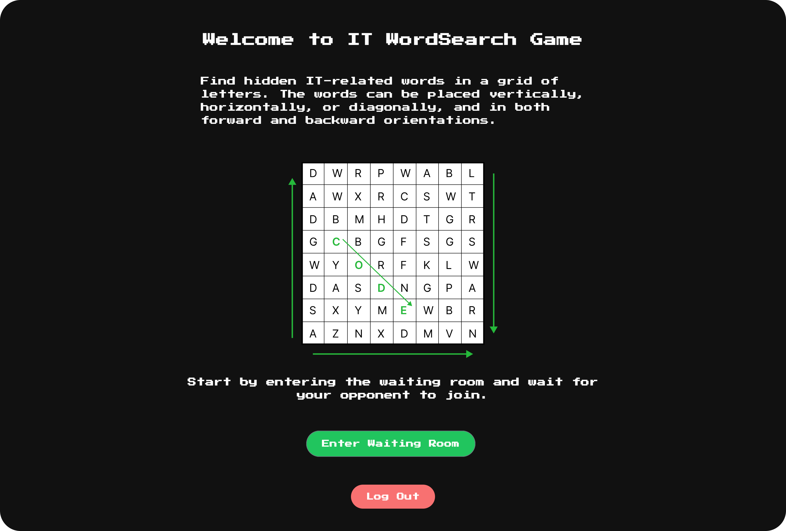

# RIT WordSearch

  

 

RIT WordSearch is a digital puzzle game where players search for IT related terms within a grid of random letters. The words can be placed vertically, horizontally, or diagonally, and in both forward and backward orientations.

The objective is for players to find all hidden words within the shortest time possible.

RIT WordSearch offers a unique blend of education and entertainment, making it an ideal game for IT professionals, students, and anyone with a keen interest in technology. It serves as an excellent tool for learning new terms, reinforcing existing knowledge, and improving vocabulary.

## Getting Started

### Requirements

- Node.js

### Installing

1. Clone, fork, or download the project.
2. Navigate to the project root directory &rarr; `rit-wordsearch`
3. Install the project dependencies &rarr; `npm install`
4. Navigate project app root directory &rarr; `app`
5. Install the project app dependencies &rarr; `npm install`
6. Add an environment variables file &rarr; `.env`
7. Start the development environment &rarr; `npm run dev`

## Tech Stack

![node.js][node.js]
![react][react]
![typescript][typescript]
![firebase][firebase]

[node.js]: https://img.shields.io/badge/node.js-339933?style=for-the-badge&logo=node.js&logoColor=white
[react]: https://img.shields.io/badge/react-61DAFB?style=for-the-badge&logo=react&logoColor=black
[typescript]: https://img.shields.io/badge/typescript-3178C6?style=for-the-badge&logo=typescript&logoColor=white
[firebase]: https://img.shields.io/badge/firebase-FFCA28?style=for-the-badge&logo=firebase&logoColor=black
